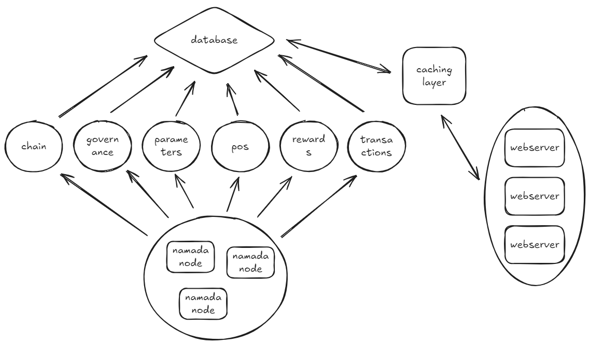
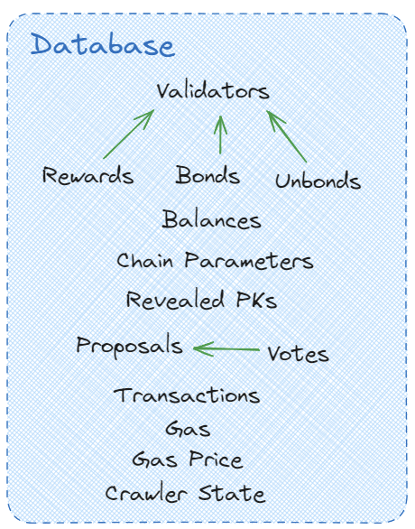

# 🟡 Namada Indexer

## Architecture

An overview of the Namada Indexer's system design and how data flows through its components.

## Data Flow

This diagram illustrates the high-level flow of data within the Namada Indexer.

## Components

Namada Indexer consists of the following services:
- Chain Service
- Governance Service
- Parameters Service
- PoS Service
- Rewards Service
- Transactions Service
- Webserver

## SRC Cards for Each Service

An overview of each service with its **Service**, **Responsibility**, and **Collaborator** details.

## Database

The Namada Indexer utilizes PostgreSQL with Diesel as the ORM. The database schema is defined in the [schema.rs](../orm/src/schema.rs) file.

## Service Communication/Orchestration

Currently, service communication is achieved by checking the database state. In the future, a message broker like Redis Streams might be introduced.

## API

API documentation is available in the [swagger.yml](../swagger.yml) file. The client is generated using the [OpenAPI Generator](https://github.com/OpenAPITools/openapi-generator), and the published versions can be found on [npm](https://www.npmjs.com/package/@namada/indexer-client).

Graphs and cards are created with ❤️ using [Excalidraw](docs_indexer_2024_12_23.excalidraw).
